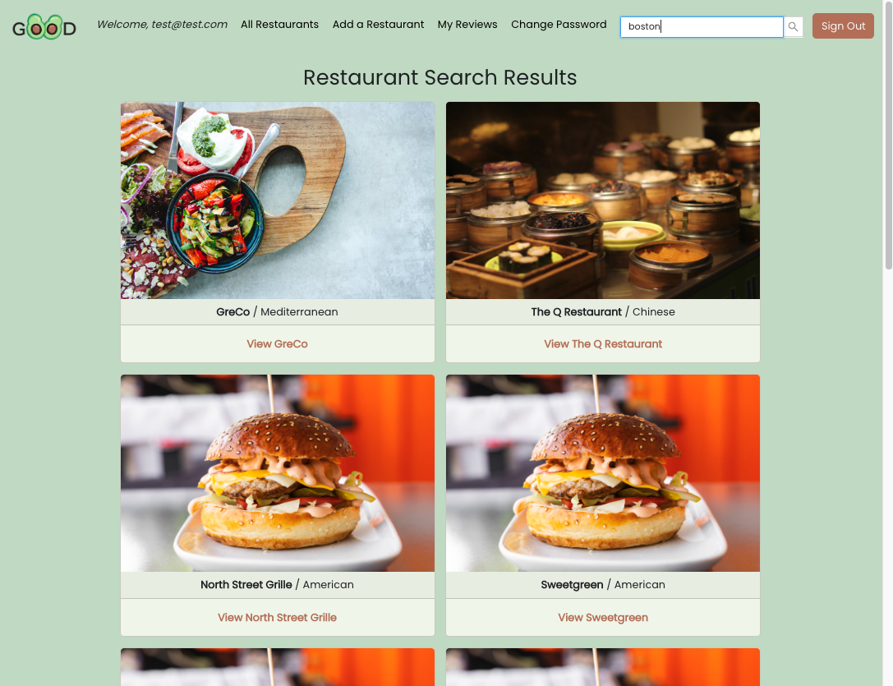

# The Good Avocado App

`Like a good avocado, a good restaurant is hard to find!`

A Yelp Mockup: Restaurant Info and Reviews

## OVERVIEW

Our application is designed to allow users to interact with various restaurants. Users can share their favorite restaurants to help users have better experiences when dining out. Users will be able to share their experiences and leave reviews.  Our intended audience is for anyone who enjoys trying new restaurants and sharing their love of food. People all over the world are always looking for insight before spending their hard earned money on a lousy meal. Food is something everyone enjoys and we hope to share a great platform to help users have great meals.

### Link
https://thegoodavocado.netlify.app/

### Brought to you by The Flossing Avocados Team

* Alina Ishizaki - https://github.com/amishizaki
* Angel Zhou - https://github.com/angel-zh
* Melanie Silva - https://github.com/melsil11
* Sam Phillips - https://github.com/sam-phillips21
 
### Technologies Used

- React
- Express
- Node.js
- MongoDB 
- Mongoose
- CSS
- JavaScript
- HTML5
- Bootstrap, Ant Design

## INSTRUCTIONS
- Create an account to access additional features, such as, adding a restaurant profile and leaving reviews and ratings.
- Browse list of available restaurants, or use the search function to find by restaurant name, type, or location.
- Navigate to the "Add a Restaurant" form to add your own restaurant to our database. You are able to edit and delete restaurants that you add.
- Navigate to any restaurant you would like to leave a review for.
- Use the "Add a Review" form to leave a comment, a rating, and photo as you please. You are able to edit and delete reviews that you add. 

## SCREENSHOTS & ERD





## ROUTES


## USER STORIES

```
As a user, I want the ability to... 
- sign up, sign in, change password, sign out
- find restaurants
- read reviews on restaurants
- review any restaurant with comments and rating
- upload images in my reviews
- add, edit, and remove my own restaurants
- update and delete my comments/reviews
- view all of my restaurant reviews in a list 
- view reviews others have created 
- favorite restaurants that other people have created
```


## Credits

Images used in our app are from [Unsplash](https://unsplash.com/).

